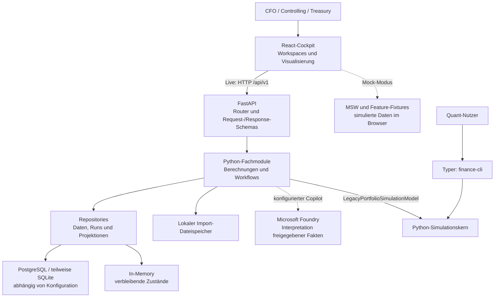
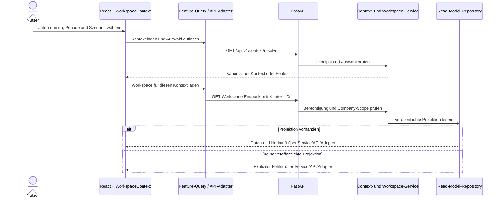
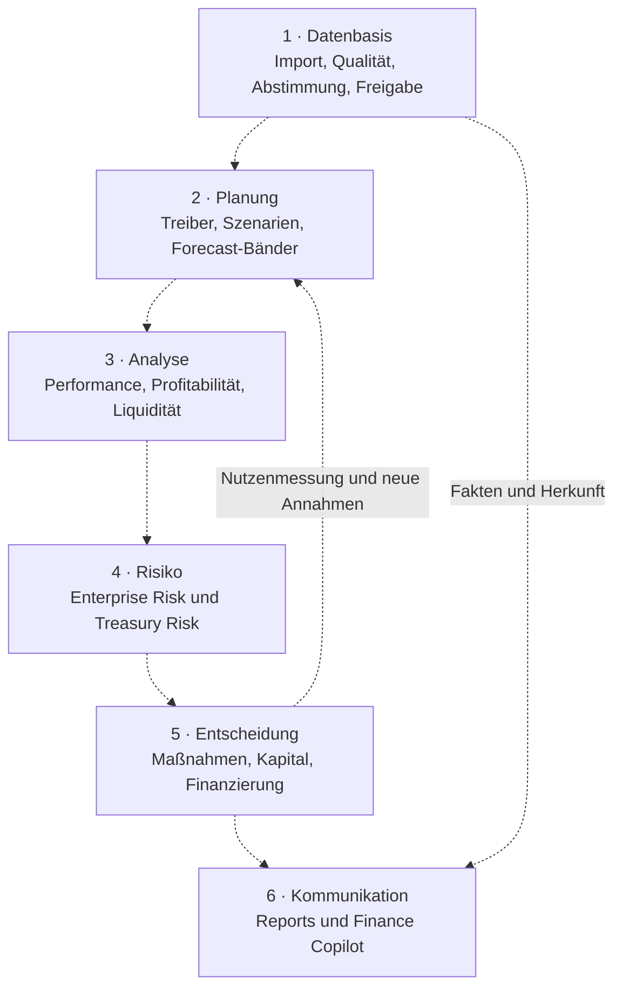
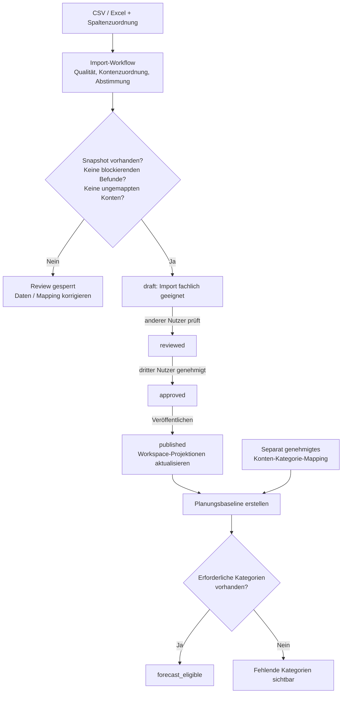
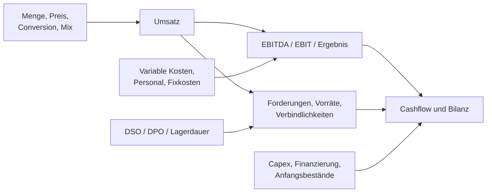
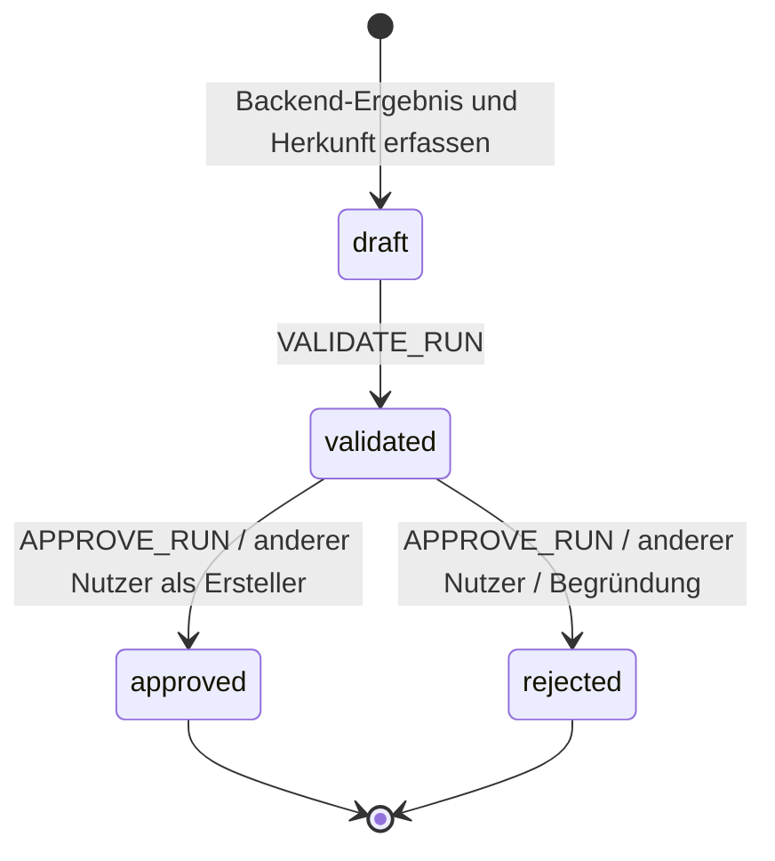
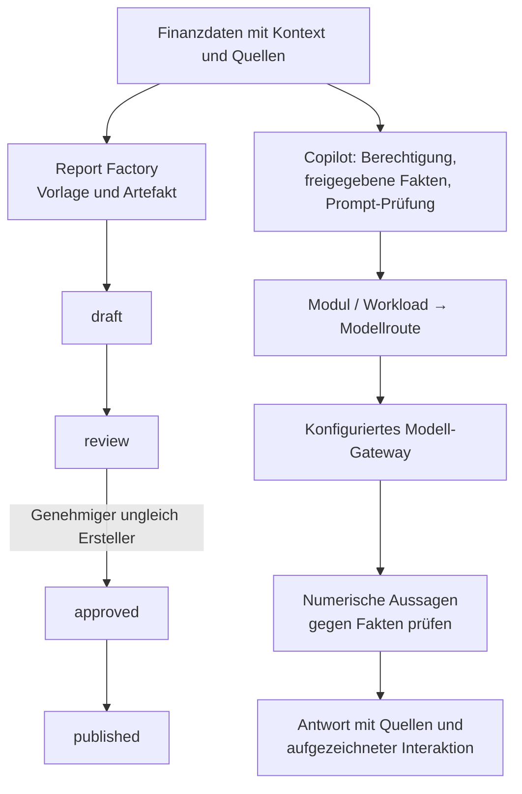
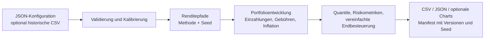

# CFO Command Center: Architektur und Business-Logik

Stand: 6. September 2026 · Zielgruppe: Fachbereich, Produkt und Entwicklung

Das CFO Command Center verbindet Finanzplanung, Ergebnisanalyse, Liquidität,
Risiken und Managemententscheidungen. Das Backend berechnet und prüft die
fachlichen Ergebnisse; das Web-Frontend macht sie verständlich und bedienbar.
Die Quant-CLI ergänzt diese Plattform um eigenständig ausführbare Simulationen.

**Geltungsbereich:** Diese Dokumentation beschreibt den am Stichtag untersuchten
lokalen Arbeitsstand. Ausgangscommit ist `f28d3ec`; die umfangreiche Migration nach
`backend/` und in die neue Frontend-Struktur ist zu diesem Zeitpunkt noch nicht
veröffentlicht. Der Dokumentationscommit veröffentlicht diese Migration nicht.
Codepfade unten beziehen sich deshalb auf den lokalen Stand und werden bewusst
als Pfadangaben geführt. Historische Epic-Dokumente sind ergänzende Quellen,
kein Nachweis einer aktuellen Produktionsabnahme.

Die Diagramme sind direkt in GitHub bzw. einer Markdown-Vorschau mit
Mermaid-Unterstützung lesbar. In den Flowcharts zeigen durchgezogene Pfeile Aufrufe,
Datenübergaben oder Prozessschritte; gestrichelte Pfeile kennzeichnen fachliche
Beziehungen oder optionale Anbindungen. Im Sequenzdiagramm sind gestrichelte Pfeile
Rückantworten. Die fachliche Prozesskarte in Abschnitt 3
ist ausdrücklich keine bereits durchgehend automatisierte Verarbeitungskette.

## 1. Das System auf einen Blick

Die Anwendung ist im untersuchten Stand ein **modularer Monolith**: Fachmodule
teilen sich eine FastAPI-Anwendung und einen Composition Root. Die Ordner für
Planning, Risk oder Reporting sind keine separat bereitgestellten Microservices.
Die CLI benötigt für ihre eigenen Befehle weder das Cockpit noch einen API-Server.

| Baustein        | Verantwortung                                                                | Einstieg im lokalen Code                                             |
| --------------- | ---------------------------------------------------------------------------- | -------------------------------------------------------------------- |
| Web-App         | Navigation, Kontextauswahl, Formulare, Diagramme, Lade-/Leer-/Fehlerzustände | `frontend/src/app/`, `frontend/src/features/`                        |
| API             | HTTP-Verträge, Eingabeprüfung, Aufruf der Fachservices                       | `backend/app/factory.py`, fachliche `router.py` und `schemas.py`     |
| Fachmodule      | Finanzmodelle, fachliche Regeln, Statusübergänge                             | `backend/app/planning/`, `risk/`, `decisions/` usw.                  |
| Zusammensetzung | Auswahl und Verdrahtung von Services und Adaptern                            | `backend/app/shared/composition.py::build_container`                 |
| Infrastruktur   | Austauschbare Repository-Implementierungen, Jobs, Telemetrie                 | `backend/app/shared/infrastructure/` und fachliche Persistenzdateien |
| Quant-CLI       | Kalibrierung, Simulation, Diagnose, Exporte                                  | `backend/finance_cli/cli.py`                                         |

Die Trennung erfolgt über Services und vorhandene Ports/Repository-Protokolle.
Einzelne Router orchestrieren mehrere Fachservices; die Darstellung behauptet
keine vollständig durchgezogene, einheitliche Use-Case-Schicht für jede Route.

## 2. Wie eine Ansicht ihre Daten erhält

Ein _Read Model_ ist eine für die Ansicht vorbereitete Datenprojektion, etwa der
CFO-Überblick. Das Cockpit berechnet daraus keine eigene Finanzwahrheit und
ersetzt fehlende Live-Daten nicht stillschweigend durch Mock-Daten.

Der maschinenlesbare Vertrag kommt aus FastAPI/Pydantic: `/openapi.json` wird nach
`backend/openapi.json` exportiert. Orval generiert daraus TypeScript-Modelle und
Operationen in `frontend/src/generated/`. Feature-Adapter und TanStack Query
verwenden diese Operationen über den gemeinsamen Fetcher. Maßgeblich für den
aktuellen Transport sind `frontend/orval.config.ts`,
`frontend/src/shared/api/client.ts` und `frontend/src/shared/lib/fetcher.ts`;
ältere Vertragsabschnitte nennen teilweise noch `openapi-fetch`.

**Betriebsarten:** `make dev-mock` liefert simulierte Vorschauen über MSW und
Feature-Fixtures. `make dev` startet die lokale API, PostgreSQL und das Frontend
mit einem lokalen Identitätsgateway; eine leere Datenbank enthält zunächst keine
Geschäftskontexte. UAT nutzt ausdrücklich vorbereitete Testdaten. Diese Modi sind
keine Produktionsidentität. Die Landingpage `/` enthält statische,
als simuliert gekennzeichnete Produktvorschauen.

## 3. Die fachliche Steuerungskette

Diese Karte erklärt den fachlichen Zusammenhang. Die Anwendung stellt die
jeweiligen Berechnungen und Workflows bereit; sie führt nicht automatisch jede
Analyse nach einem Import aus oder setzt eine freigegebene Maßnahme extern um.

| Bereich         | Fachliche Frage                                 | Zentrale Logik / Ergebnis                                                                           |
| --------------- | ----------------------------------------------- | --------------------------------------------------------------------------------------------------- |
| Planning        | Welches Ergebnis erwarten wir?                  | Treiberbasierte GuV, Bilanz und Cashflow; Rolling Forecast; probabilistische Bänder und Backtesting |
| Performance     | Warum weichen wir vom Plan ab?                  | Abweichungsanalyse, Prognosegüte, Anomalien, Management-Kommentare                                  |
| Profitability   | Wo verdienen wir Geld?                          | Ergebnisbeiträge, Kostenallokation, Activity-Based Costing, Margensensitivität und Margin-at-Risk   |
| Liquidity       | Können wir unsere Zahlungen leisten?            | 13-Wochen- und Monatsplanung, Working Capital, Schulden, Covenants und Stress                       |
| Enterprise Risk | Welche Unternehmensrisiken bedrohen den Plan?   | Risikoregister, Quantifizierung, Aggregation, Risikoappetit und Risk-to-Plan                        |
| Treasury Risk   | Wie wirken Marktbewegungen auf Exposures?       | Sensitivitäten, VaR, Stress, GARCH-t, Regime-/Tail-Modelle, Abhängigkeiten und Hedge-Szenarien      |
| Actions         | Welche Maßnahme soll umgesetzt werden?          | Simulation, Priorisierung, Review und Nutzenmessung                                                 |
| Capital         | Welche Projekte und Finanzierungen passen?      | Projektbewertung, Monte-Carlo-NPV, Portfolioauswahl unter Restriktionen, Funding-Szenarien          |
| Reporting       | Was darf als freigegebener Bericht erscheinen?  | Vorlagen, Artefakte und menschlicher Freigabeprozess                                                |
| Finance Copilot | Wie lassen sich vorhandene Ergebnisse erklären? | Berechtigte Fakten, Modellrouting, Quellenbezüge und Prüfung numerischer Aussagen                   |

Beispiel ohne erfundene Kennzahlen: Ein veränderter Absatztreiber verändert den
Planumsatz. Die Liquiditätsanalyse kann den dazugehörigen Finanzierungsbedarf
untersuchen. Treasury bewertet passende Stress- oder Hedge-Szenarien. Eine
Maßnahme oder Kapitalalternative wird berechnet und zur Freigabe vorgelegt.
Ein Bericht macht das Ergebnis nachvollziehbar; der Copilot erläutert vorhandene
Fakten. Die Auswahl und Übergabe zwischen diesen Schritten bleibt explizit.

## 4. Von einer Importdatei zur belastbaren Planungsbasis

Ein technisch gespeicherter Snapshot ist noch keine fachliche Veröffentlichung.
`FinanceImport.run_eligible` beschreibt die Qualitätsvoraussetzung für das Review;
erst `publish` aktualisiert die zugehörigen Workspace-Projektionen. Der
Import-Ersteller darf nicht selbst prüfen. Genehmigen darf weder der Ersteller
noch der Prüfer. Das Veröffentlichen erfordert eine Genehmigungsberechtigung,
aber keinen zusätzlichen vierten Nutzer.

Die Planungsbaseline benötigt einen veröffentlichten Quell-Snapshot und ein
genehmigtes Mapping. Sie summiert die Werte für genau ein Unternehmen, eine
Periode und ein Szenario nach Kategorien und berücksichtigt die im Mapping
festgelegten Vorzeichen. Fehlende Pflichtkategorien werden ausgewiesen; im Code
zählen Kategorien mit Wert null dabei als fehlend. Eine gespeicherte Baseline
ist somit nicht automatisch forecast-fähig.

Quellen: `backend/app/data/data_workflow.py`, `data_publication.py` sowie
`backend/app/planning/planning_baseline.py`. Der Import-Enum enthält außerdem
`rejected`; der untersuchte Publication-Service bietet dafür keinen eigenen
Übergang an. Das Diagramm zeigt deshalb nur die implementierte Übergangskette.

## 5. Wie aus Annahmen Ergebnis und Unsicherheit werden

Die treiberbasierte Engine rechnet unter anderem
`Umsatz = Menge × Preis × Conversion × Mix` und
`EBITDA = Umsatz − variable Kosten − Personalkosten − fixe operative Kosten`.
Abschreibungen führen zum EBIT; Working Capital und Investitionen beeinflussen
den Cashflow. Das konkrete Modell und seine Periodenannahmen stehen in
`backend/app/planning/planning.py`; die Grafik ist keine universelle
Rechnungslegungsspezifikation.

Unsicherheit ist ein eigener Modellschritt: Die probabilistische Forecast-Engine
erhält deterministische Werte, historische Residuen, Methode, Pfadzahl und Seed.
Sie erzeugt additive Schocks mittels Student-t, Moving-Block-Bootstrap oder
Markov-Regime und liefert P10/P50/P90 sowie Mittelwerte. Diese Quantile sind
modellabhängige Szenariobänder. Backtesting und Schwellenwertanalyse prüfen die
Modellgüte bzw. Zielerreichung; sie machen aus einem Forecast keine Zusage.

Quellen: `backend/app/planning/probabilistic_forecast.py`,
`forecast_backtesting.py`, `forecast_thresholds.py`.

## 6. Entscheidung und Freigabe sind verschiedene Schritte

Die Action-/Capital-Endpunkte berechnen das Ergebnis im Backend und übergeben
es mit Parametern und Herkunft an den Decision-Run-Service. Eine erfolgreiche
Berechnung erzeugt einen Entwurf, noch keine genehmigte Entscheidung.

Jeder Decision Run trägt Kontext (`company_id`, `period_id`, `scenario_id`),
fachliche Referenzen, Quell-Snapshot-IDs, Projektionsversion, Modellversion,
Parameter, Ergebnis und Bearbeiter. Zustandsänderungen erzeugen Ereignisse mit
Nutzer und Korrelations-ID. So lässt sich zurückverfolgen, auf welcher Basis eine
Entscheidung getroffen wurde.

Der Service verlangt Berechtigungen und prüft den Company-Scope des Kontexts.
Der `Idempotency-Key` ist pro Nutzer gebunden: dieselbe Anfrage kann denselben
Run zurückliefern; ein abweichender Request-Hash führt zum Konflikt. Er ersetzt
keinen allgemeinen Cache für Berechnungen. `validated` ist ein Workflowstatus,
keine erneute unabhängige Modellberechnung. Für die Validierung verbietet dieser
Service nicht generell den Ersteller; für Genehmigung und Ablehnung tut er es.
Ein genehmigter Run löst keine automatische Zahlung oder reale Investition aus.

Quellen: `backend/app/decisions/router.py` und `decision_workflow.py`.
Die Herkunftsfelder sind vorhanden; eine vollständige produktive Absicherung
aller referenzierten Daten und dauerhafte Speicherung bleiben gesondert zu
prüfen. Aktuell verwendet der Container ein `InMemoryDecisionRunRepository`.

## 7. Reporting und Copilot

Reporting besitzt einen eigenen Lebenszyklus. Der Report-Run-Service prüft
Kontext und Berechtigungen; das Genehmigen verlangt einen anderen Nutzer als den
Ersteller. `published` bezeichnet den Workflowstatus und bedeutet nicht, dass ein
Bericht automatisch per E-Mail versandt oder extern bereitgestellt wurde.

Der Copilot soll vorhandene Ergebnisse erläutern. Seine Route wird nach
Finanzmodul und Workload ausgewählt, mit konfigurierten Ersatz-Deployments bei
Modellaufruffehlern. Fakten werden nach Freigabe und Unternehmenszugriff gefiltert.
Der Service prüft numerische Tokens der Modellantwort gegen die bereitgestellten
Fakten und speichert Quellenbezüge sowie die verwendete Modellroute. Das ist ein
konkreter Schutzmechanismus, aber kein vollständiger semantischer Beweis für jede
Aussage. Er ist keine Finance-Rechenengine und führt keine Freigaben aus.

Quellen: `backend/app/reporting/report_workflow.py`, `reporting_factory.py`,
`backend/app/copilot/ai_foundry.py` und `router.py`. Eine echte Foundry-Anbindung
ist konfigurationsabhängig. Ein Echo-Gateway in lokalen UAT-Nachweisen belegt
keine Abnahme eines realen Modells.

## 8. Die eigenständige Quant-CLI

`simulate`, `diagnose`, `backtest`, `sensitivity` und `wizard` sind eigenständige
CLI-Befehle. Bootstrap-Simulationen benötigen historische Daten; andere Methoden
können mit konfigurierten Annahmen starten. Reproduzierbarkeit hängt neben dem
Seed auch von Daten, Parametern und Softwareversionen ab. Das Manifest hält diese
Basis fest. Das CLI-Steuermodell ist ausdrücklich eine vereinfachte Besteuerung
des Endgewinns.

Der Backend-Adapter `LegacyPortfolioSimulationModel` verwendet denselben
Simulationskern und verlangt einen Seed. Er stellt jedoch nicht automatisch alle
CLI-Diagnosen, Steuerberechnungen oder Dateiexporte als API-Funktion bereit.

Quellen: `backend/finance_cli/cli.py`, `simulation.py`, `reporting.py` und
`backend/app/shared/quant/legacy_portfolio.py`.

## 9. Was heute dauerhaft gespeichert wird

Die Auswahl erfolgt in `build_container`; die Tabelle beschreibt diese
Verdrahtung, keine neue Speicherarchitektur.

| Zustand                                                                | Ohne Datenbank-Konfiguration                  | Mit PostgreSQL-URL              |
| ---------------------------------------------------------------------- | --------------------------------------------- | ------------------------------- |
| Governance-Runs und Audit-Ereignisse                                   | In-Memory; bei SQLite-Pfad stattdessen SQLite | PostgreSQL                      |
| Daten-Snapshots und Import-Metadaten                                   | In-Memory                                     | PostgreSQL                      |
| Planungs-Mappings und Baselines                                        | In-Memory                                     | PostgreSQL                      |
| Workspace-Projektionen                                                 | In-Memory                                     | PostgreSQL                      |
| Importdateien                                                          | Lokaler Dateispeicher                         | Weiterhin lokaler Dateispeicher |
| Decision Runs, Report Runs und Report-Repository                       | In-Memory                                     | Weiterhin In-Memory             |
| Rolling Forecasts, Szenarien, Governance-Modellkatalog                 | In-Memory                                     | Weiterhin In-Memory             |
| Generische Model Runs, Finance Model Runs und Job-Verwaltung           | In-Memory                                     | Weiterhin In-Memory             |
| Risiko-/Maßnahmenregister, Benefit-/Capital-Kataloge, AI-Interaktionen | In-Memory                                     | Weiterhin In-Memory             |

Finance Model Runs werden zusätzlich in `backend/app/factory.py` mit einem
In-Memory-Repository aufgebaut. Ein konfiguriertes PostgreSQL macht daher nicht
alle Workflows dauerhaft: Prozessneustarts verlieren weiterhin In-Memory-Zustand.
Auch persistierte Workspace-Projektionen ersetzen nicht die Speicherung ihrer
ursprünglichen fachlichen Runs.

Produktionsidentität, vollständige Mandantentrennung, verbleibende Persistenz,
dauerhafte Jobs/Report-Artefakte, reale AI-Abnahme und Betriebs-/Recovery-Nachweise
sind getrennte Lieferaufgaben. Vorhandene lokale Container und Telemetrie sind
kein Nachweis, dass diese Anforderungen bereits erfüllt sind.

## Quellen und Pflege

Der Codeabgleich erfolgte für die oben genannten lokalen Dateien sowie
`backend/app/shared/composition.py`, `backend/app/factory.py`,
`backend/app/shared/principal.py`, `frontend/src/app/navigation.ts` und
`frontend/orval.config.ts`. Diese Dokumentation ändert weder Finanzlogik noch
API-Verträge und führt keine neue Architekturentscheidung ein.

Ergänzende Dokumente:

- [Foundation und Servicegrenzen](epic-01-completion.md)
- [Planung](epic-04-completion.md), [Liquidität](epic-07-completion.md),
  [Kapitalallokation](epic-13-completion.md)
- [Frontend-/Backend-Verträge](../frontend-backend-contracts.md)
- [Backend-Produktionsintegration](../backend-production-integration-roadmap.md)
- [Aufgabe #59](https://github.com/Timeless90/finance-cli-app/issues/59)
- [GitHub Project #2: verbindlicher Aufgabenstatus](https://github.com/users/Timeless90/projects/2)

Bei Änderungen an Composition Root, Workflow-Übergängen oder API-Anbindung sind
die betroffenen Diagramme und die Persistenztabelle erneut mit dem Code
abzugleichen. Der Aufgabenstatus wird ausschließlich im GitHub-Projekt gepflegt.
