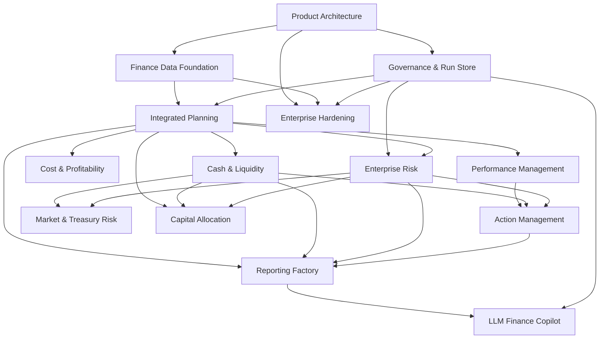

# CFO Product Implementation Roadmap

## 1. Zielbild

Die bestehende `finance-cli-app` wird schrittweise von einer quantitativen Portfolio- und Simulationsanwendung zu einer modularen CFO-Steuerungsplattform weiterentwickelt.

Die Plattform soll CFOs, FP&A, Treasury, Risk Management, Controlling, Vorstand und Aufsichtsrat dabei unterstützen,

- Unternehmensleistung konsistent zu messen,
- integrierte Forecasts zu erstellen,
- Ergebnis-, Cash- und Covenant-Risiken probabilistisch zu bewerten,
- Maßnahmen zu simulieren und zu priorisieren,
- Management- und externe Berichte nachvollziehbar zu erzeugen,
- statistische Ergebnisse über einen kontrollierten AI-Copilot verständlich zu machen.

Die zentrale Value Proposition lautet:

> Aus Ist-Daten, operativen Treibern und Risiken entsteht ein nachvollziehbarer, probabilistischer Unternehmensforecast mit konkreten Steuerungsmaßnahmen und auditierbaren Berichtsbausteinen.

## 2. Planungsannahmen

Der Zeitplan basiert auf folgenden Annahmen:

- Kernteam: Product Owner / Finance Domain, Backend, Data Engineering, Frontend, Quant, QA und Security.
- Zweiwöchige Sprints.
- Ein Epic entspricht einem fachlichen Modul oder einem produktweiten Enabler.
- Die Laufzeiten sind Richtwerte und setzen voraus, dass kritische Fachentscheidungen zeitnah getroffen werden.
- Enterprise-Connectoren, IFRS-/HGB-Spezifika und produktive Mandantenfähigkeit können den Aufwand erhöhen.
- Die bestehende Python-Simulationslogik wird als Quantitative Model Execution Layer weiterverwendet.

## 3. Gesamtzeitplan

| Phase | Zeitraum | Ziel | Enthaltene Epics |
|---|---:|---|---|
| Phase 0 – Product Foundation | Monat 1–3 | Technische und fachliche Basis schaffen | E0, E1, E2 |
| Phase 1 – FP&A MVP | Monat 3–7 | Nutzbares Forecast- und Performance-Produkt | E3, E4, E5 |
| Phase 2 – CFO Control | Monat 6–10 | Liquidität, Covenants und Enterprise Risk integrieren | E6, E7 |
| Phase 3 – Decision Intelligence | Monat 9–13 | Reporting, Maßnahmensteuerung und AI-Copilot | E8, E9, E10 |
| Phase 4 – Advanced Finance | Monat 12–18 | Treasury-, Markt- und Kapitalallokationsfunktionen | E11, E12 |
| Phase 5 – Enterprise Scale | Monat 15–21 | Mandantenfähigkeit, Betrieb, Compliance und Skalierung | E13 |

## 4. Priorisierung

### Unmittelbar als Nächstes

1. **E0 – Product Architecture & Domain Separation**
2. **E1 – Finance Data Foundation**
3. **E2 – Governance, Run Store & Audit Trail**
4. **E3 – Integrated Planning & Rolling Forecast**
5. **E6 – Cash, Liquidity & Covenant Control**

Diese Reihenfolge ist verbindlich, weil statistisch anspruchsvolle Modelle ohne abgestimmte Unternehmensdaten, Versionierung und Reproduzierbarkeit keinen belastbaren Produktwert erzeugen.

---

# 5. Epic- und Feature-Plan

## E0 – Product Architecture & Domain Separation

**Ziel:** Den bestehenden ETF-/Portfolio-Kontext vom zukünftigen Unternehmenskontext trennen und eine API-fähige modulare Plattformarchitektur schaffen.

**Value Proposition:** Ermöglicht die Wiederverwendung des quantitativen Kerns, ohne das bestehende Domainmodell künstlich auf Unternehmensplanung umzudeuten.

**Zeitraum:** Monat 1–2

### Features

#### E0-F1 – Modularisierung des Quant-Kerns

- Trennung von Simulation, Kalibrierung, Risiko, Backtesting und Reporting.
- Einführung klarer Interfaces für Forecast- und Risk-Modelle.
- Entkopplung von CLI, Domainlogik und Persistenz.

**Acceptance Criteria**

- Bestehende Simulationen laufen unverändert über neue Interfaces.
- Unit- und Regressionstests sichern identische Ergebnisse.
- Kein fachliches Portfolioobjekt ist Voraussetzung für generische Simulationen.

#### E0-F2 – Enterprise Domain Model

- Gesellschaften, Konten, Kostenstellen, Profitcenter, Produkte, Kunden und Perioden.
- Szenarien, Annahmesätze, Versionen und Reporting-Währungen.
- GuV-, Bilanz- und Cashflow-Strukturen.

**Acceptance Criteria**

- Beispielunternehmen kann vollständig modelliert werden.
- Jede Kennzahl besitzt Dimension, Periode, Einheit, Version und Quelle.

#### E0-F3 – API Foundation

- FastAPI-basierte Service-Schicht.
- OpenAPI-Spezifikation.
- Einheitliche Fehler-, Validierungs- und Job-Statusmodelle.

**Acceptance Criteria**

- Forecast-, Risk- und Data-Endpunkte sind versioniert.
- API-Schema wird automatisiert getestet.

#### E0-F4 – Background Job Execution

- Asynchrone Ausführung langer Simulationen.
- Jobstatus, Fortschritt, Abbruch und Wiederaufnahme.
- Trennung interaktiver Requests von rechenintensiven Runs.

**Acceptance Criteria**

- Lange Simulationen blockieren keine API-Worker.
- Jobs sind reproduzierbar und eindeutig referenzierbar.

---

## E1 – Finance Data Foundation

**Ziel:** Vertrauenswürdige, abgestimmte und versionierte Unternehmensdaten bereitstellen.

**Value Proposition:** Reduziert manuelle Datenkonsolidierung, verhindert Versionskonflikte und schafft die Grundlage für belastbare Forecasts und Berichte.

**Zeitraum:** Monat 1–4

### Features

#### E1-F1 – CSV- und Excel-Ingestion

- Standardisierte Imports für Hauptbuch, Budget, Forecast und operative Treiber.
- Schemaerkennung und Mapping-Assistent.
- Validierung von Datentypen, Perioden, Währungen und Dimensionen.

#### E1-F2 – Finance Semantic Model

- Harmonisiertes Konten- und Dimensionsmodell.
- KPI-Definitionen und Kennzahlenhierarchien.
- Mapping von Quellsystemfeldern auf Finance-Dimensionen.

#### E1-F3 – Data Quality Framework

- Vollständigkeit, Eindeutigkeit, Wertebereiche, Periodenkonsistenz.
- Blockierende und nicht blockierende Fehler.
- Data Quality Score je Datenstand.

#### E1-F4 – Reconciliation Engine

- Trial-Balance-Prüfung.
- Abstimmung von Importen mit Hauptbuch- und Abschlusswerten.
- Intercompany- und Währungsprüfungen.

#### E1-F5 – Data Snapshotting

- Unveränderliche Datenstände je Abschluss- oder Forecast-Stichtag.
- Snapshot-ID als Pflichtreferenz für Runs.
- Hash-basierte Integritätsprüfung.

**Epic Acceptance Criteria**

- Kritische Datenfehler blockieren Forecast-Runs.
- Jeder Forecast ist auf einen konkreten Daten-Snapshot zurückführbar.
- Hauptbuchsummen stimmen gegen definierte Referenzwerte.

---

## E2 – Governance, Run Store & Audit Trail

**Ziel:** Reproduzierbarkeit, Nachvollziehbarkeit und Freigaben produktweit sicherstellen.

**Value Proposition:** Macht Ergebnisse revisionsfähig und schafft Vertrauen bei CFO, Risk, Revision und Wirtschaftsprüfung.

**Zeitraum:** Monat 2–4

### Features

#### E2-F1 – Versioned Run Store

- Persistenz von Forecast-, Risk-, Backtest- und Report-Runs.
- Speicherung von Codeversion, Daten-Snapshot, Parametern und Seed.
- Statusmodell: Draft, Validated, Approved, Retired.

#### E2-F2 – Scenario & Assumption Store

- Versionierte Base-, Upside-, Downside- und Stressszenarien.
- Clone-, Compare- und Approval-Workflow.
- Verantwortlicher Owner je Annahme.

#### E2-F3 – Model Registry

- Modell-ID, Version, Owner, Validierungsstatus und Limitations.
- Verknüpfung mit Backtests und Freigaben.
- Lifecycle-Status und Deprecation.

#### E2-F4 – Immutable Audit Trail

- Änderungen an Daten, Annahmen, Modellen und Berichten.
- Benutzer, Zeitstempel, Vorher-/Nachher-Wert und Begründung.

#### E2-F5 – Role-Based Access Control

- Rollen für CFO, FP&A, Risk, Treasury, Controller, Reviewer und Admin.
- Datenzugriff nach Gesellschaft und Organisationseinheit.

**Epic Acceptance Criteria**

- Identischer Snapshot, Code, Konfiguration und Seed erzeugen identische Ergebnisse.
- Jede veröffentlichte Zahl besitzt vollständige Lineage.
- Freigegebene Runs können nicht überschrieben werden.

---

## E3 – Integrated Planning & Rolling Forecast

**Ziel:** Integrierte GuV-, Bilanz- und Cashflow-Planung mit probabilistischen Bandbreiten ermöglichen.

**Value Proposition:** Ersetzt statische Einzelwerte durch treiberbasierte Forecasts mit P10/P50/P90 und transparenter Zielverfehlungswahrscheinlichkeit.

**Zeitraum:** Monat 3–7

### Features

#### E3-F1 – Driver-Based Revenue Planning

- Absatz, Preis, Mix, Backlog, Pipeline und Conversion.
- Segment-, Produkt- und Regionenplanung.

#### E3-F2 – Cost & Workforce Planning

- Material-, Personal-, Energie-, Logistik- und sonstige Kosten.
- FTE-, Gehalts-, Eintritts- und Austrittsplanung.

#### E3-F3 – Integrated Statements

- Automatische Verknüpfung von GuV, Bilanz und Cashflow.
- Working-Capital- und Capex-Logik.
- Bilanzkontrolle und Cash-Reconciliation.

#### E3-F4 – Rolling Forecast Workflow

- 12-, 18- und 24-Monats-Horizonte.
- Monatsabschluss-Refresh.
- Versionierung und Freigabe.

#### E3-F5 – Probabilistic Forecast Overlay

- Student-t als robuste Baseline.
- Moving Block Bootstrap bei zeitlicher Abhängigkeit.
- Markov-Regime nur bei nachgewiesenem Out-of-Sample-Nutzen.
- Monte-Carlo-Verteilungen für EBITDA, EBIT, Cashflow und Zielkennzahlen.

#### E3-F6 – Forecast Backtesting

- Rolling-Origin-Evaluation.
- MAE, WAPE, Bias, Coverage und Log-Score.
- Modellvergleich pro KPI und Horizont.

#### E3-F7 – Goal & Threshold Engine

- Zielwerte, Warnschwellen und Shortfall-Wahrscheinlichkeiten.
- KPI-, Cash- und Covenant-Grenzen.

**Epic Acceptance Criteria**

- GuV, Bilanz und Cashflow sind rechnerisch integriert.
- Forecasts enthalten deterministische und probabilistische Ergebnisse.
- Kein Future Leakage in Backtests.
- Ergebnisbänder werden gegen historische Coverage validiert.

---

## E4 – Financial Performance Management

**Ziel:** Plan-Ist-Forecast-Abweichungen erklären und in Maßnahmen übersetzen.

**Value Proposition:** Zeigt nicht nur, dass ein KPI abweicht, sondern warum und wo Management handeln sollte.

**Zeitraum:** Monat 5–8

### Features

#### E4-F1 – KPI Tree

- Umsatz bis EBITDA, EBIT, Free Cashflow und ROIC.
- Drilldown nach Gesellschaft, Segment, Produkt und Kostenstelle.

#### E4-F2 – Variance Analysis

- Plan-Ist-, Forecast-Ist- und Forecast-Forecast-Vergleich.
- Preis-Mengen-Mix-Analyse.
- Kosten- und Working-Capital-Bridges.

#### E4-F3 – Forecast Accuracy Dashboard

- Fehler nach KPI, Business Unit, Horizont und Modell.
- Bias und strukturelle Über-/Unterplanung.

#### E4-F4 – Anomaly Detection

- Ausreißer und unerwartete KPI-Bewegungen.
- Regelbasierte und statistische Hinweise.

#### E4-F5 – Management Commentary Inputs

- Pflichtkommentare bei wesentlichen Abweichungen.
- Verknüpfung mit Maßnahmen und Owners.

**Epic Acceptance Criteria**

- Variance Bridges erklären 100 Prozent der ausgewiesenen Abweichung.
- Jeder Beitrag ist reproduzierbar und auf Quelldaten zurückführbar.

---

## E5 – Cost & Profitability Management

**Ziel:** Margen, Deckungsbeiträge und Profitabilität nach relevanten Dimensionen steuern.

**Value Proposition:** Identifiziert unprofitable Produkte, Kunden, Kanäle und Kostenstrukturen und unterstützt gezielte Gegenmaßnahmen.

**Zeitraum:** Monat 6–9

### Features

- Deckungsbeitragsrechnung.
- Kostenstellen- und Profitcenter-Analyse.
- Produkt-, Kunden- und Kanalprofitabilität.
- Activity-Based-Costing-Option.
- Preis- und Kosten-Sensitivitäten.
- Margin-at-Risk.

**Epic Acceptance Criteria**

- Profitabilitätswerte stimmen mit GuV und Kostenrechnung überein.
- Kostenallokationen sind versioniert und nachvollziehbar.

---

## E6 – Cash, Liquidity & Covenant Control

**Ziel:** Liquiditätsrisiken und Finanzierungsengpässe frühzeitig erkennen.

**Value Proposition:** Liefert dem CFO eine operative Frühwarnung über Cash, Mindestliquidität, Funding Gap und Covenant-Verletzungen.

**Zeitraum:** Monat 6–10

### Features

#### E6-F1 – 13-Week Cash Forecast

- Direkte Cash-Planung auf Wochenbasis.
- Bank, AR, AP, Payroll, Steuern, Capex und Finanzierung.

#### E6-F2 – Monthly Liquidity Forecast

- 12- bis 24-monatige Liquiditätsplanung.
- Verknüpfung mit integriertem Unternehmensforecast.

#### E6-F3 – Working Capital Model

- DSO, DPO, DIO und Zahlungsprofile.
- Probabilistische Einzugs- und Zahlungszeitpunkte.

#### E6-F4 – Debt Schedule

- Kreditlinien, Darlehen, Zins, Tilgung und Laufzeit.
- Refinanzierungsbedarf und Fälligkeiten.

#### E6-F5 – Covenant Engine

- Leverage Ratio, Interest Cover und kundenspezifische Formeln.
- Headroom und Verletzungswahrscheinlichkeit.

#### E6-F6 – Liquidity Stress Testing

- Umsatzrückgang, Forderungsverzug, Kostenanstieg und Refinanzierungsschock.
- Gegenmaßnahmen und Funding-Optionen.

**Epic Acceptance Criteria**

- Bank- und Cashwerte sind abgestimmt.
- Covenant-Formeln werden gegen Vertragsbeispiele getestet.
- Cash-Forecast-Genauigkeit wird nach Horizont gemessen.

---

## E7 – Enterprise Risk Management

**Ziel:** Qualitative Risiken, quantitative Risikosimulation und Maßnahmen in einem integrierten Prozess verbinden.

**Value Proposition:** Führt Risk Register, Risikoaggregation, Limits, Controls und Finanzplanung in einer gemeinsamen Steuerungssicht zusammen.

**Zeitraum:** Monat 7–11

### Features

#### E7-F1 – Risk Register

- Risiko, Ursache, Event, Owner, Kategorie und Zeitraum.
- Brutto-/Nettorisiko und Kontrollen.

#### E7-F2 – Risk Quantification

- Eintrittswahrscheinlichkeit, Frequenz und Schadensverteilung.
- Empirische, Lognormal-, Pareto- und benutzerdefinierte Verteilungen.

#### E7-F3 – Risk Aggregation

- Monte-Carlo-Aggregation.
- Korrelationsmatrix als Baseline.
- Copula-Option erst nach Daten- und Governance-Reife.

#### E7-F4 – Risk Appetite & Limits

- Limits nach Kategorie, KPI und Risikotragfähigkeit.
- Warnungen und Eskalationen.

#### E7-F5 – Controls & Mitigation

- Kontrollwirkung, Maßnahmenkosten und verbleibendes Risiko.
- Maßnahmenstatus und Verantwortlichkeiten.

#### E7-F6 – Risk-to-Plan Integration

- Überführung finanzieller Risikoauswirkungen in GuV, Bilanz und Cashflow.
- Vermeidung von Doppelzählungen.

#### E7-F7 – Risk Reporting

- Top-Risiken, Heatmap, Verlustverteilung und Stressbeiträge.
- Berichtsfähige Beschreibungen und Methodiknachweise.

**Epic Acceptance Criteria**

- Einzelrisiken sind bis zur Gesamtverteilung nachvollziehbar.
- Doppelzählungs- und Korrelationsprüfungen sind dokumentiert.
- Maßnahmenwirkung ist separat ausweisbar.

---

## E8 – Action & Decision Management

**Ziel:** Analyseergebnisse in konkrete Entscheidungen und Maßnahmen überführen.

**Value Proposition:** Schließt die Lücke zwischen Diagnose und Umsetzung.

**Zeitraum:** Monat 9–12

### Features

- Maßnahmenkatalog mit Owner, Termin, Kosten und erwarteter Wirkung.
- Maßnahmensimulation auf EBITDA, Cash und Covenants.
- Maßnahmenportfolio und Priorisierung.
- Status-, Eskalations- und Review-Workflow.
- Realized-vs-Planned-Benefit-Tracking.

**Epic Acceptance Criteria**

- Maßnahmenwirkungen sind zeitlich und finanziell integriert.
- Doppelzählungen zwischen Maßnahmen werden erkannt.
- Realisierte Effekte können gegen Plan gemessen werden.

---

## E9 – Reporting Factory

**Ziel:** Konsistente, versionierte und auditierbare Management- und External-Reporting-Artefakte erzeugen.

**Value Proposition:** Verkürzt Reportingzyklen und gewährleistet, dass Dashboard, Board Pack und Lagebericht auf denselben freigegebenen Zahlen basieren.

**Zeitraum:** Monat 9–13

### Features

#### E9-F1 – Template Engine

- Wiederverwendbare Tabellen, Charts, Texte und Metadaten.
- Versionierte Berichtsvorlagen.

#### E9-F2 – Management Pack

- KPI, Performance, Forecast, Cash, Risiken und Maßnahmen.

#### E9-F3 – Board Risk Pack

- Top-Risiken, Risikotragfähigkeit, Stress und Limits.

#### E9-F4 – Forecast Report

- Annahmen, P10/P50/P90, Zielverfehlungen und Modellgüte.

#### E9-F5 – Lagebericht Draft

- Wirtschaftsbericht, Prognose, Chancen und Risiken.
- Strukturierte Bausteine mit Quellen- und Run-Verweisen.

#### E9-F6 – Audit Evidence Pack

- Lineage, Freigaben, Modellversionen, Annahmen und Hashes.

#### E9-F7 – Export

- PDF, Excel, PowerPoint, CSV und JSON.
- Später ESEF-/XBRL-ready Datenpakete.

**Epic Acceptance Criteria**

- Berichtszahlen stimmen exakt mit freigegebenen Runs überein.
- Jede wesentliche Aussage besitzt Daten- und Run-Lineage.
- Externe Berichte erfordern Human Approval.

---

## E10 – LLM Finance Copilot

**Ziel:** Statistische und finanzielle Ergebnisse verständlich erklären, ohne Berechnungen zu erfinden.

**Value Proposition:** Übersetzt komplexe Forecast-, Risiko- und Performance-Ergebnisse in entscheidungsrelevante Managementaussagen.

**Zeitraum:** Monat 10–14

### Features

#### E10-F1 – Grounded Management Summary

- Zusammenfassung ausschließlich aus freigegebenen KPI- und Run-Daten.
- Quellenreferenz je wesentlicher Aussage.

#### E10-F2 – Explain Variance

- Beantwortung von Warum-Fragen über deterministische Analyse-APIs.

#### E10-F3 – Explain Risk

- Interpretation von P10/P50/P90, VaR, Expected Shortfall, Stress und Regimen.

#### E10-F4 – Action Recommendations

- Vorschläge nur aus vorhandenen Maßnahmenoptionen und Simulationsergebnissen.
- Keine autonome Freigabe oder Buchung.

#### E10-F5 – Report Drafting

- Entwürfe für Management Summary, Risikobericht und Lagebericht.

#### E10-F6 – AI Governance

- Prompt- und Antwortprotokoll.
- Berechtigungsgefiltertes Retrieval.
- Prompt-Injection- und Data-Leakage-Tests.
- Human Approval für externe Texte.

**Epic Acceptance Criteria**

- Das LLM berechnet keine Finanzwerte selbst.
- Alle Zahlen stimmen mit Tool-Ausgaben überein.
- Antworten nennen Datenlücken und Modellgrenzen.
- Unberechtigte Daten werden nicht offengelegt.

---

## E11 – Market & Treasury Risk

**Ziel:** FX-, Zins-, Rohstoff- und Finanzierungsrisiken quantitativ steuern.

**Value Proposition:** Verbindet operative Planung mit Marktpreisrisiken, Hedge-Entscheidungen und regulatorisch relevanten Risikodisclosures.

**Zeitraum:** Monat 12–17

### Features

- Exposure Management.
- Sensitivitätsanalysen.
- VaR und Expected Shortfall.
- GARCH-t für zeitvariable Volatilität.
- Markov-Regime-Overlay.
- EVT-Tail-Overlay.
- Copula-basierte Abhängigkeiten.
- Hedge-Szenarien und Hedge Effectiveness.
- Kupiec- und Christoffersen-Backtests.

**Epic Acceptance Criteria**

- Modelle bestehen definierte Backtests und Stabilitätsprüfungen.
- HMM und GARCH werden nur bei nachgewiesenem Mehrwert aktiviert.
- Risikoergebnisse sind reproduzierbar und vollständig dokumentiert.

---

## E12 – Capital Allocation & Funding

**Ziel:** Investitionen und Finanzierung risikoadjustiert priorisieren.

**Value Proposition:** Unterstützt den CFO dabei, Kapital in Projekte mit dem besten Verhältnis aus Wertbeitrag, Risiko und Finanzierungskapazität zu lenken.

**Zeitraum:** Monat 13–18

### Features

- Capex- und Projektportfolio.
- NPV, IRR, ROIC und Payback.
- Monte-Carlo-NPV.
- Risiko- und Szenariointegration.
- Portfoliooptimierung unter Budget-, Cash- und Covenant-Grenzen.
- Funding- und Refinanzierungsszenarien.

**Epic Acceptance Criteria**

- Referenzprojekte liefern validierte NPV-/IRR-Werte.
- Portfolio-Constraints werden immer eingehalten.
- Auswirkungen auf Cash und Covenants sind integriert.

---

## E13 – Enterprise Hardening & Scale

**Ziel:** Die Plattform sicher, skalierbar und mandantenfähig betreiben.

**Value Proposition:** Erfüllt die Voraussetzungen für Enterprise-Vertrieb und produktiven Einsatz in sensiblen Finanzprozessen.

**Zeitraum:** Monat 15–21

### Features

- Tenant Isolation.
- SSO, MFA und fein granularer Zugriff.
- Verschlüsselung und Secret Management.
- Observability, Monitoring und Alerting.
- Backup, Restore und Disaster Recovery.
- Last- und Performancetests.
- SAST, DAST und Dependency Scanning.
- Data Retention und Löschkonzepte.
- Data Residency und Subprocessor-Dokumentation.
- Audit- und Compliance-Evidence.

**Epic Acceptance Criteria**

- Tenant-Isolation ist technisch getestet.
- Restore- und Disaster-Recovery-Test wurde erfolgreich durchgeführt.
- Kritische Security Findings sind geschlossen.
- Definierte SLAs und SLOs werden überwacht.

---

# 6. Release-Meilensteine

## Release R0 – Architecture Baseline

**Zieltermin:** Ende Monat 2

**Enthält**

- E0-F1 bis E0-F3.
- Grundlegendes Enterprise-Domainmodell.
- Versionierte API-Schnittstellen.

## Release R1 – Data & Governance Foundation

**Zieltermin:** Ende Monat 4

**Enthält**

- E1 vollständig.
- E2 vollständig.
- Erste Weboberfläche für Import, Datenqualität und Runs.

## Release R2 – FP&A MVP

**Zieltermin:** Ende Monat 7

**Enthält**

- Integrierte GuV, Bilanz und Cashflow.
- Rolling Forecast.
- Base-, Upside- und Downside-Szenarien.
- P10/P50/P90 und Zielverfehlungswahrscheinlichkeiten.
- Forecast Backtesting.

## Release R3 – CFO Control Tower

**Zieltermin:** Ende Monat 10

**Enthält**

- Performance Cockpit.
- 13-Week Cash Forecast.
- Covenant Headroom.
- Enterprise Risk Register und Aggregation.

## Release R4 – Decision Intelligence

**Zieltermin:** Ende Monat 14

**Enthält**

- Action Management.
- Reporting Factory.
- Grounded Finance Copilot.

## Release R5 – Advanced Finance Suite

**Zieltermin:** Ende Monat 18

**Enthält**

- Treasury- und Marktrisikomodelle.
- Capital Allocation.
- Advanced Modellvalidierung.

## Release R6 – Enterprise Ready

**Zieltermin:** Ende Monat 21

**Enthält**

- Enterprise Hardening.
- Mandantenfähigkeit.
- Security-, Audit- und Betriebsnachweise.

---

# 7. Abhängigkeitsstruktur

# 8. Empfohlene Teamstruktur

| Rolle | Hauptverantwortung |
|---|---|
| Product Lead / Finance Domain | Produktpriorisierung, CFO-Use-Cases, fachliche Abnahme |
| Solution Architect | Zielarchitektur, Schnittstellen und technische Standards |
| Backend Engineers | APIs, Domainservices, Workflow und Persistenz |
| Data Engineers | Ingestion, Semantic Model, Quality und Lineage |
| Quant Engineers | Simulation, Forecasting, Risk und Validierung |
| Frontend Engineers | CFO Dashboard, Workflows und Visualisierung |
| QA / Test Automation | Unit-, Integrations-, Regression- und End-to-End-Tests |
| Security / Platform | IAM, Betrieb, Observability, Compliance und Hardening |
| Finance SME / Controller | Referenzfälle, Reconciliation und fachliche Testdaten |

# 9. Produktweite Definition of Done

Ein Feature ist erst abgeschlossen, wenn alle zutreffenden Kriterien erfüllt sind:

- Fachliche Ergebnisse stimmen gegen geprüfte Referenzfälle.
- Automatisierte Unit-, Integrations- und Regressionstests sind vorhanden.
- Datenherkunft, Transformationen und Modellversion sind nachvollziehbar.
- Identische Inputs erzeugen reproduzierbare Ergebnisse.
- Berechtigungen und Audit Trail sind umgesetzt.
- API und Benutzeroberfläche behandeln Fehler verständlich.
- Statistische Modelle besitzen dokumentierte Backtests und Limitations.
- Exporte stimmen exakt mit freigegebenen Dashboardwerten überein.
- LLM-Ausgaben sind grounded und verwenden keine selbst berechneten Finanzwerte.
- Security-, Datenschutz- und Betriebsanforderungen wurden geprüft.

# 10. Nächste konkrete Umsetzungsschritte

## Sprint 1–2

- Zielarchitektur und Domain-Grenzen festlegen.
- Bestehenden Quant-Kern inventarisieren.
- `ForecastModel`- und `RiskModel`-Interfaces definieren.
- Enterprise-Domainmodell als ADR und Schema dokumentieren.

## Sprint 3–4

- Run Store und Data Snapshot Store implementieren.
- CSV-/Excel-Ingestion für Actuals und Forecasts.
- Data Quality Rules und erste Reconciliation.

## Sprint 5–6

- GuV-Basismodell und Revenue-/Cost-Driver.
- Base-/Upside-/Downside-Szenarien.
- API-Endpunkte und erste Dashboardansicht.

## Sprint 7–8

- Bilanz- und Cashflow-Integration.
- Probabilistisches Forecast-Overlay.
- Rolling-Origin-Backtest und Coverage-Dashboard.

## Sprint 9–10

- 13-Week Cash Forecast.
- Working-Capital-Treiber.
- Covenant Engine und Warnschwellen.

# 11. Erfolgsmessung

| Dimension | KPI |
|---|---|
| Prozessgeschwindigkeit | Dauer eines Forecast-Zyklus |
| Automatisierung | Anteil automatisch verarbeiteter Daten und Reports |
| Datenqualität | Anteil fehlerfreier oder vollständig abgestimmter Datenstände |
| Forecast-Qualität | WAPE, Bias, Coverage und Log-Score |
| Risikosteuerung | Vorlaufzeit erkannter Cash-, Covenant- oder Ergebnisrisiken |
| Managementnutzung | Aktive Nutzer und beantwortete Entscheidungsfragen |
| Reporting | Zeit vom Daten-Freeze bis zum freigegebenen Board Pack |
| Governance | Anteil vollständig lineage-fähiger Kennzahlen und Berichte |
| AI-Qualität | Numerische Konsistenz, Quellenabdeckung und Halluzinationsrate |

# 12. Strategische Produktpositionierung

Die Plattform soll nicht als allgemeines EPM-System positioniert werden, sondern als:

> **Risk-adjusted CFO Decision Platform für integrierte Planung, Liquidität, Risiko und erklärbare Managemententscheidungen.**

Der differenzierende Produktkern besteht aus:

1. integrierter Unternehmensplanung,
2. probabilistischen Forecasts,
3. quantitativer Risiko- und Liquiditätsfrühwarnung,
4. durchgängiger Daten- und Modellgovernance,
5. einem grounded Finance Copilot,
6. auditierbaren Management- und Berichtsoutputs.
