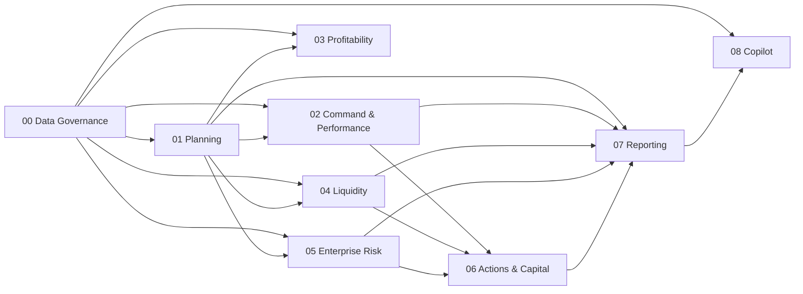

# Modulübergreifende Abhängigkeiten & Ein-Personen-Betrieb

## Produktreihenfolge

**Kritischer Pfad für den ersten nutzbaren Betrieb:**
`00 Data Governance → 01 Planning → 02 Command & Performance → 04 Liquidity → 07 Reporting`.
Profitability, Enterprise Risk, Actions/Capital und Copilot erweitern diesen
Pfad; sie dürfen ihn nicht blockieren.

## Betriebsprinzipien für eine Person

1. **Ein Datenstand je Zyklus.** Erst der freigegebene Snapshot, dann alle
   darauf aufbauenden Runs. Keine parallelen, versteckten Excel-Stände.
2. **Ein Publish-Fenster.** Nach Review werden Planning-, Performance- und
   Liquidity-Read-Models gemeinsam publiziert. Reporting konsumiert nur diesen
   Stand.
3. **Ein Arbeitskorb.** Offene Datenfehler, Reviews, Breaches, überfällige
   Actions und fehlgeschlagene Jobs erscheinen in einer priorisierten Queue.
4. **Automatisierung nur mit Rückfallebene.** Import- und Export-Schedules
   starten zunächst manuell. Erst nach stabilen Wiederholungen kommen Jobs und
   Benachrichtigungen dazu.
5. **Keine optionalen Modelle ohne Datenbetrieb.** Market Risk, komplexe
   Copulas, Foundry und große Optimierungen werden erst aktiviert, wenn ihre
   Daten- und Validierungsroutine tatsächlich geleistet werden kann.

## Empfohlener Monatsrhythmus

| Zeitpunkt | Betreiberaktion | Systemergebnis |
| --- | --- | --- |
| Abschluss + 0 | ERP/CSV importieren, Mapping/Qualität/Abstimmung prüfen | Snapshot als `IN_REVIEW` |
| Abschluss + 1 | Snapshot freigeben, Planning- und Liquidity-Runs starten | neue Entwürfe mit Lineage |
| Abschluss + 2 | Varianzen, Cash, Covenants und Top-Risiken prüfen | Kommentare und Maßnahmen-Entwürfe |
| Abschluss + 3 | Runs/Read-Models publizieren | Command Center als verbindlicher Stand |
| Abschluss + 4 | Management Pack erzeugen und freigeben | versioniertes Artefakt |

In der lokalen Einzelumgebung testet die Profilumschaltung die erforderliche
Trennung von Erfassung, Review und Approval. Sie bedeutet nicht, dass mehrere
reale Personen zwingend nötig sind; im Produktivbetrieb müssen Freigaben jedoch
an eine echte, unabhängige Identität und die Organisationsrichtlinie gebunden
sein.

## Minimaler technischer Betrieb

| Komponente | Jetzt lokal | Später bei produktiver Nutzung |
| --- | --- | --- |
| Datenbank | dedizierter PostgreSQL-Container | Managed PostgreSQL, Backups/Restore getestet |
| Dateien/Artefakte | lokales Docker-Volume | Object Storage mit Lifecycle und Backup |
| API/Frontend | lokaler Backend-Container und Vite | Container Deployment, OIDC und Reverse Proxy |
| Jobs | synchron oder manuell gestartet | Queue/Worker nur für lange Runs und Exporte |
| Beobachtbarkeit | Health, strukturierte Logs, Container-Restart | Metriken, Alerts, zentrale Logs |
| AI | lokaler Echo-Adapter | Foundry mit Identity, Secret Management und Evaluation |

## Priorisierte Releases

| Release | Ziel | Enthalten |
| --- | --- | --- |
| S1 – Controlled Data | stabiler Import-/Snapshot-/Publish-Zyklus | DG-01 bis DG-03, CP-01 |
| S2 – Forecast Control | verbindlicher treiberbasierter Forecast | PF-01 bis PF-03, CP-02 |
| S3 – Cash Control | tägliche und monatliche Finanzsteuerung | LI-01 bis LI-02, CP-03 |
| S4 – Decision & Report | nachvollziehbare Maßnahmen und Monatsreport | AC-01, RE-01 bis RE-02 |
| S5 – Optional Intelligence | Risiko, Profitability, Copilot/Foundry nach Nutzen | PR, RI, CO in dieser Reihenfolge |

## Gesamt-Definition of Done

Die Anwendung ist für einen Betreiber sinnvoll nutzbar, wenn dieser ohne
manuelle Datenkopien einen Import bis zum freigegebenen Snapshot führt, daraus
Forecast und Liquidität publiziert, eine Abweichung kommentiert bzw. eine
Maßnahme verfolgt und einen reproduzierbaren Management-Report exportiert.
Alle darüber hinausgehenden Modelle bleiben aktivierte Optionen mit eigener
Data-/Governance-Checkliste.
